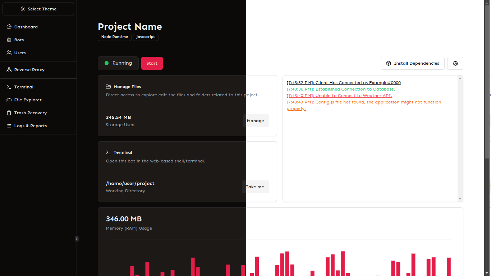

> [!IMPORTANT]
> - [Getting Started](./docs/GETTING-STARTED.MD): Use this link if you want to learn how to set this software up.
> - [Core API](./core/README.MD): The application's backend server written in Typescript using Encore.ts.
> - [WebUI](./web/README.MD): The frontend UI developed using Next.js.

> [!NOTE]
> - [Contribution](./CONTRIBUTING.MD): Here you'll find information on how you can contribute through opening issues and making pull requests.
> - [Old Panel](https://github.com/jub0t/old-mechon): Source code of the old discord manager.
> - [Licenses](./license/README.MD): Both commercial and non-commercial(for independant users) licenses are available.
